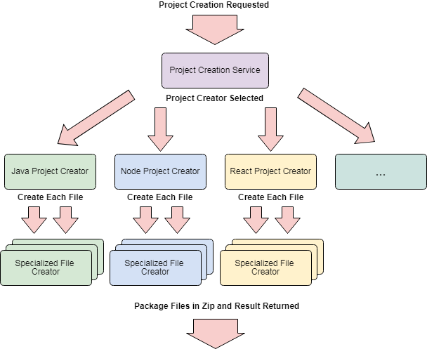
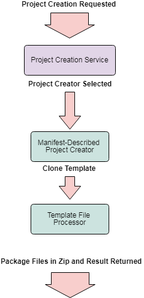

# Project Roadmap

## Scope

This application is intended to allow:
- Generation and download of multi-file software code project structures based on project templates
  - Exposed via HTTP interface
  - Template context could be dynamically expanded
- Retrieval of project templates through a variety of configurable storage mechanisms
  - Initial version will support templates included in the classpath
  - Possible future improvements:
    - Retrieve from public URL
    - Retrieve from source control 
- Discovery of the types of projects that can be generated by the application
  - Exposed via HTTP interface

## Current State

Currently the application has the following characteristics:
- Each project type is registered in code
- Code is written to control project creation logic
- Each project creator is responsible for:
  - Determining which files to create and how to create them (direct copy, template transformation, combining templates)
  - Creating a directory structure and project files on disk in a known location
- The directory structure that is created is zipped and returned
- A clean up process is scheduled to remove that directory structure

The current implementation provides the maximum amount of flexibility when creating projects, because any logic can be coded to describe exactly how to generate the project. However, this has the following shortcomings:
- Adding or modifying project templates is difficult without thorough understanding of internals
- Project templates are tightly coupled with code, meaning a change to a template often requires a rebuild
- The client of this application must be made aware of what types of projects are valid external to the application (no discovery)
 
The current flow for creating a new project is shown below:

## Next State

To make this product simpler for others to customize and integrate into their environments, it would be beneficial for the templates to be generated based on external configuration. This would allow others to create and customize project templates without having to customize the application.

This would have the following behaviour:
- A project template is defined by a manifest file which describes all the files to be included (either implicitly or explicitly)
  - Files are identified which must flow through the templating system
- The project template defines a default template context (a set of variables and default values)
  - Used to centralize control of variables which may be project-wide
  - Could be used to easily update commonly changing values (ie: library versions) without updating templates

Upon completion of this stage, the flow for creating a new project would look something like this:

The workflow for the generation of projects based on the manifest file would likely be as shown below:

## Possible Future State

Eventually, once the manifest-based project generation has been implemented, projects can be migrated from the current code-based implementations to equivalent configuration-based implementations. Once that's been done we can retire those parts of the system, to simplify the flow greatly:

## Big Picture

The Accelerator Initializer contains other components that are not yet open-source. In the future the accelerator initializer will include components that will allow automatic provisioning of source control repositories, CI/CD infrastructure, and possibly even more. The following diagram shows how the Accelerator Initializer fits in with other systems, as well as which parts of the Accelerator Initializer are currently open source (shown in green).

